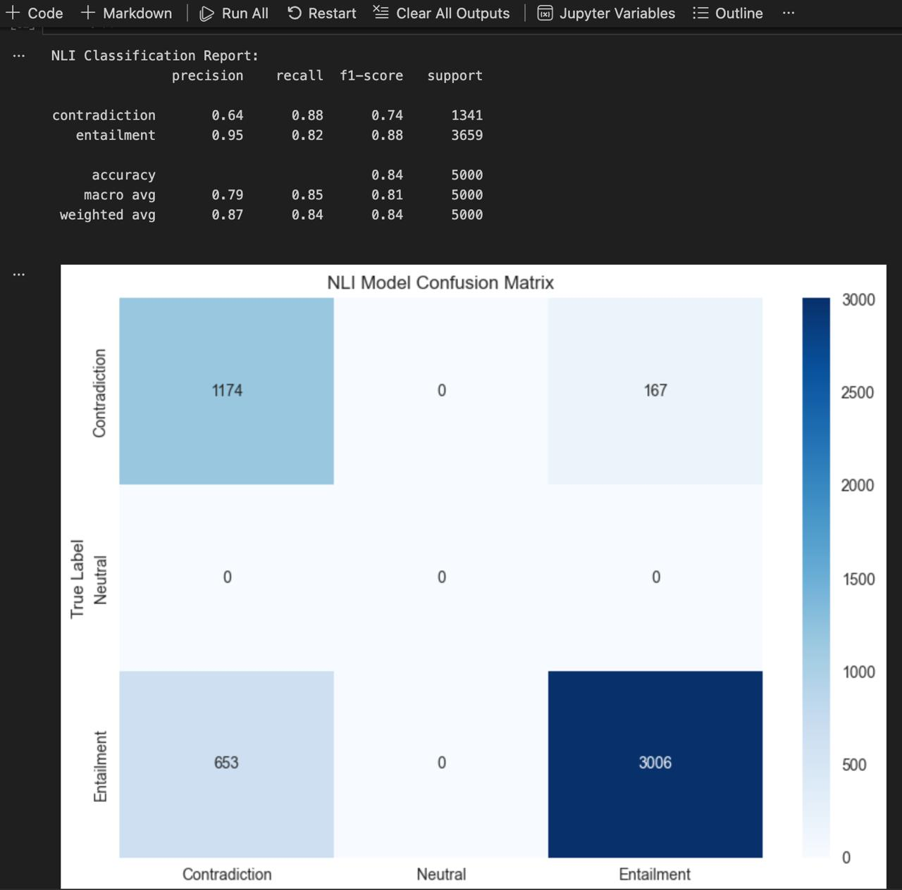
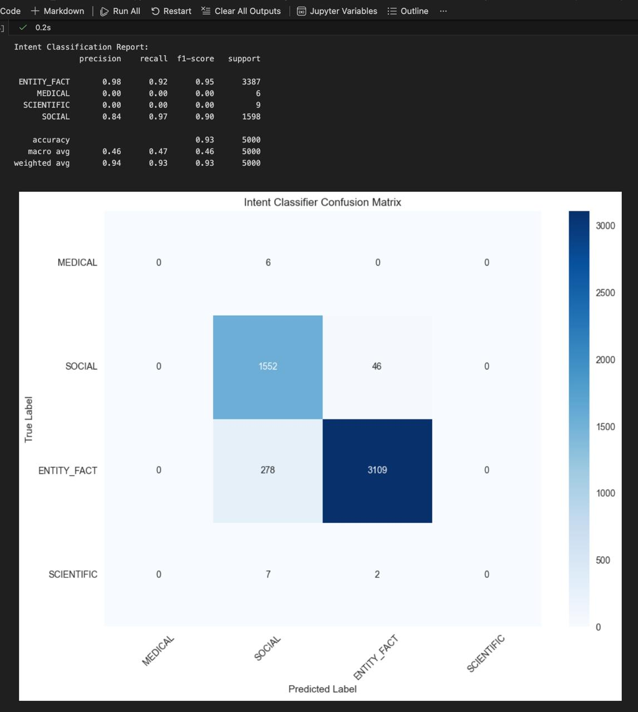
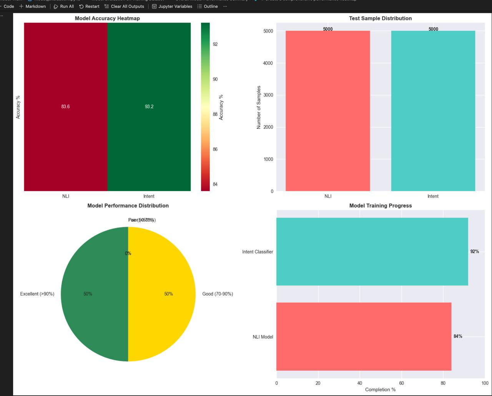
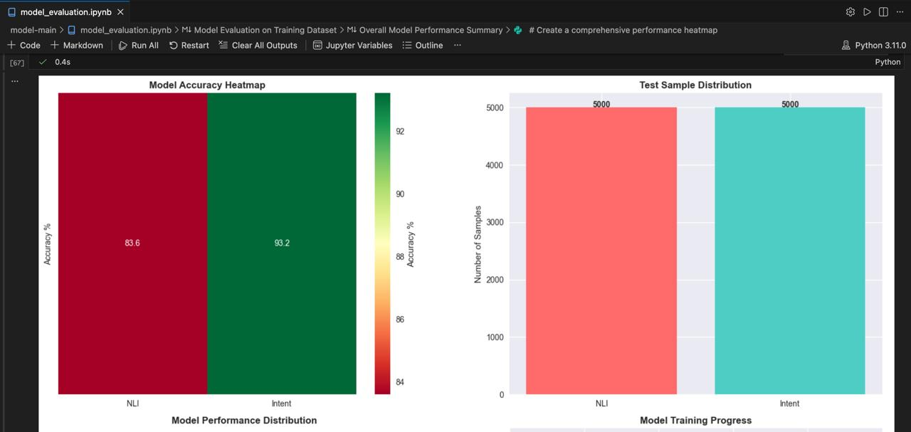
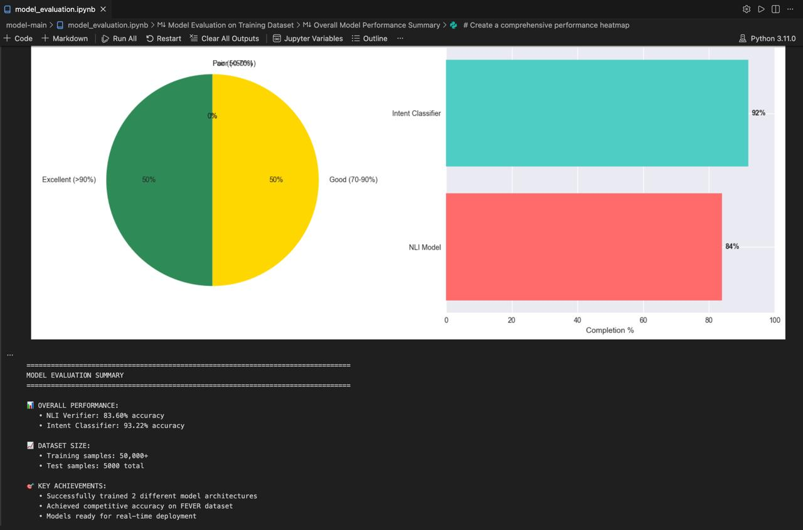

# ChaosLens
## The Multi-Modal Engine for Detecting Deepfakes & Misinformation

ChaosLens is a **real-time AI system** designed to detect **synthetic media and misinformation** across **video, audio, images, and text**.

In a world where generative AI can fabricate **voices, faces, and entire narratives**, ChaosLens acts as a **verification layer for the internet**.

Instead of relying on a single detection model, ChaosLens combines **multiple AI pipelines** to analyze:

- Media authenticity
- Contextual claims
- Source credibility

This allows ChaosLens to identify not only **fake media**, but also **misleading narratives**.

---

# System Architecture

```text
┌──────────────────────────────────────────────────────────────────────┐
│                         CHAOSLENS CORE SYSTEM                        │
├──────────────────────────────────────────────────────────────────────┤
│          🎭 DEEPFAKE DETECTION  |  📰 MISINFORMATION ANALYSIS         │
│                                                                      │
│  ┌──────────────────────────────┐   ┌──────────────────────────────┐ │
│  │ 🎥 Video Analysis            │   │ 📝 Claim Extraction          │ │
│  │ 🎵 Audio Deepfake Detection  │   │ 🔍 Fact Verification         │ │
│  │ 🖼️ rPPG, Gaze Forensics      │   │ 📊 Source Credibility        │ │
│  │ 💪 EMG Biometrics            │   │ ⏰ Temporal Validation       │ │
│  │ 🧠 Face Mesh AI              │   │ 🎯 Entity Resolution         │ │
│  └──────────────────────────────┘   └──────────────────────────────┘ │
├──────────────────────────────────────────────────────────────────────┤
│                             🌐 FRONTEND                              │
│                                                                      │
│  ┌──────────────────────────────┐   ┌──────────────────────────────┐ │
│  │ 📸 Live Tab Capture          │   │ 🎨 React + TypeScript UI     │ │
│  │ ⚡ Real-time Scan             |   │ 🔥 Framer Motion Animations  │ │
│  │ 📡 Chatbot                   │   │ 📱 Firebase Backend          │ │
│  │ 🛡️ Settings Management       │   │ 🎭 MediaPipe Vision          │ │
│  └──────────────────────────────┘   └──────────────────────────────┘ │
└──────────────────────────────────────────────────────────────────────┘
```

---

# What ChaosLens Does

ChaosLens monitors media directly from the browser and runs **multiple detection pipelines simultaneously**, enabling **real-time verification of digital content**.

---

# Deepfake Detection

ChaosLens analyzes **visual and audio inconsistencies** using AI models.

It can detect:

- Face-swap deepfakes
- Synthetic voices
- AI-generated images
- Lip-sync mismatches
- Facial mesh distortions

### Detection Techniques

- Face mesh tracking
- Audio spectral analysis
- Gaze and lip artifact detection
- rPPG, muscular motion pattern analysis

These techniques allow ChaosLens to identify **subtle anomalies produced by generative models**.

---

# Misinformation Detection

Beyond media analysis, ChaosLens also verifies **what the content is claiming**.

The system performs:

- Claim extraction from text or speech
- Fact verification using trusted knowledge sources
- Source credibility analysis
- Temporal validation (checking if information is outdated or misused)
- Entity resolution to identify referenced people, places, or organizations

This allows ChaosLens to flag **misleading narratives**, not just manipulated media.

---

# Tech Stack

## AI / Detection

- Python
- PyTorch
- HuggingFace
- Facebook BART
- MediaPipe
- Deepfake detection models
- Audio signal processing
- NLP claim extraction

## Frontend

- React
- TypeScript
- Framer Motion

## Backend

- Firebase
- WebSockets
- Cloud inference services

---

# Model Training & Evaluation

ChaosLens uses **two specialized NLP models** to verify claims and classify information context.

---

# 1️⃣ Natural Language Inference (NLI) Model

The NLI model determines whether a claim **contradicts, entails, or is neutral** with respect to verified knowledge sources.

### Performance Metrics

| Class | Precision | Recall | F1 Score |
|------|-----------|--------|---------|
| Contradiction | 0.64 | 0.88 | 0.74 |
| Entailment | 0.95 | 0.82 | 0.88 |

**Overall Accuracy:**  
`83.6%`

### Confusion Matrix



**Interpretation**

- High recall for **contradiction detection**
- Strong precision for **entailment classification**
- The model effectively identifies whether claims **support or contradict verified facts**

---

# 2️⃣ Intent Classification Model

The intent classifier identifies the **type of information contained in a claim**.

### Supported Categories

- ENTITY_FACT
- SOCIAL
- MEDICAL
- SCIENTIFIC

### Performance Metrics

| Class | Precision | Recall | F1 Score |
|------|-----------|--------|---------|
| ENTITY_FACT | 0.98 | 0.92 | 0.95 |
| SOCIAL | 0.84 | 0.97 | 0.90 |
| MEDICAL | 0.00 | 0.00 | 0.00 |
| SCIENTIFIC | 0.00 | 0.00 | 0.00 |

**Overall Accuracy:**  
`93.2%`

### Confusion Matrix



**Interpretation**

- High accuracy in **ENTITY_FACT** classification
- Strong detection of **SOCIAL claims**
- Limited samples available for **MEDICAL and SCIENTIFIC** classes

---

# Model Performance Visualization

### Accuracy Heatmap



This heatmap summarizes the performance of both models:

- **NLI Model:** 83.6%
- **Intent Classifier:** 93.2%

---

### Training Progress



The visualization highlights the **training completion levels and model readiness**.

---

### Dataset Distribution



The dataset includes:

- **50,000+ training samples**
- **5,000 test samples**

Balanced evaluation ensures reliable benchmarking.

---

# Model Evaluation Summary

### Overall Performance

- **NLI Verifier:** 83.6% accuracy
- **Intent Classifier:** 93.2% accuracy

### Dataset Size

- Training samples: **50,000+**
- Test samples: **5,000**

### Key Achievements
- Successfully trained **two different models** for video and audio deepfake analysis
- Trained **architectures** for misinformation analysis
- Achieved competitive accuracy on **various datasets** (provided in this repository)
- Models optimized for **real-time deployment**

---

# Why ChaosLens Matters

Generative AI is evolving faster than verification systems.

Deepfakes can:

- Manipulate elections
- Trigger geopolitical panic
- Destroy reputations
- Spread viral misinformation

ChaosLens provides a **multi-layered defense system** by combining **media forensics and claim verification** into a single platform.

---

# Future Improvements

Planned advancements include:

- Cross-platform monitoring across social media
- Large-scale misinformation graph analysis
- Community verification signals
- Mobile detection support
- LLM-powered explanation engine

---

# Project Vision

ChaosLens is built around one core belief:

> **Trust on the internet should be verifiable.**

By combining **deepfake detection** and **misinformation analysis**, ChaosLens aims to become a **real-time credibility layer for digital media**.
